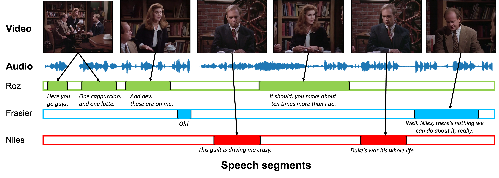

# Look, Listen and Recognise : character-aware audio-visual subtitling (ICASSP 2024)



[[project_page]](https://www.robots.ox.ac.uk/~vgg/research/look-listen-recognise/) [[arXiv]](https://arxiv.org/abs/2401.12039) [[code]](https://github.com/JaesungHuh/ca-subtitle)

Bruno Korbar*, Jaesung Huh*, Andrew Zisserman

(* denotes equal contribution.)

## Update
- This is version 1.1. We noticed there are some annotation errors in the initial version we used in the paper. Please use the current annotation for appropriate evaluation.

## Dataset
### Castlist
- We offer a cast list for each episode, featuring character names alongside the corresponding actor or actress's name. If an actor or actress's name is not available, it will be listed as 'unknown'.

### CSV
- The files in directory csv contains start_time,end_time,speaker,transcript for each episode. Start_time and end_time are in seconds.

### RTTM
- To evaluate on speaker diarization performance, we also convert the csv files to [rttm](https://github.com/nryant/dscore?tab=readme-ov-file#rttm) format.

### Audio and video files
- Please contact jaesung at robots dot ac dot uk.

## Reference
```
@article{korbar2023look,
      author    = {Korbar, Bruno and Huh, Jaesung and Zisserman, Andrew},
      title     = {Look, Listen and Recognise: character-aware audio-visual subtitling},
      booktitle = {ICASSP},
      year      = {2024},
}
```
